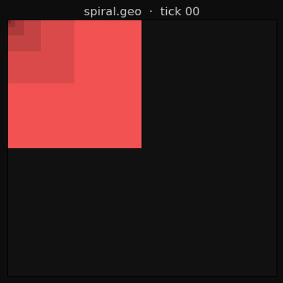
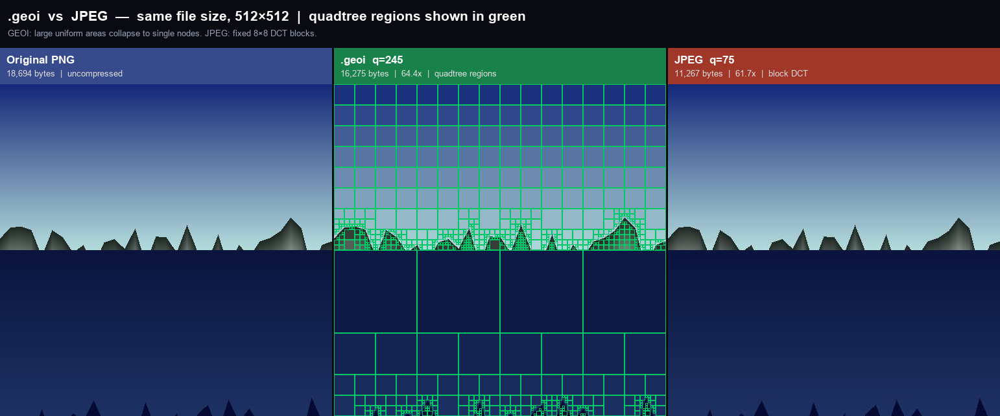
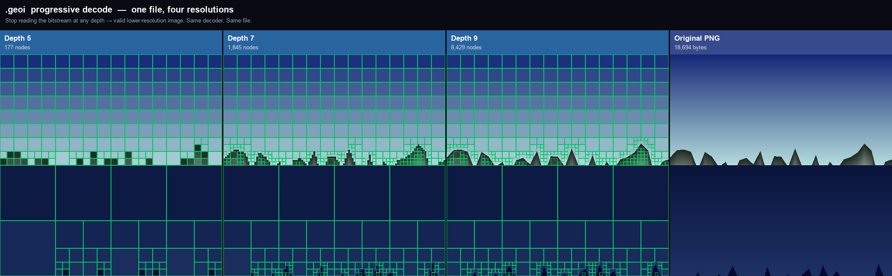

# BinaryQuadTreeCPUTest

**Two experiments in the same idea: space as a recursive language.**

> A fractal grammar engine where 4-bit masks program geometry — and a binary image codec that uses the same spatial logic to beat JPEG compression.





---

## What Is This?

This repo contains two separate but deeply related systems built on a single insight:
**a square can always be divided into four smaller squares, and that fact is a complete computational primitive.**

### 1. The GEO Grammar Engine *(Python — proof of concept)*

A declarative scripting language where you program **how fractal geometry evolves over time**.
Each node in a recursive quadtree carries a 4-bit mask. The mask controls which quadrants are
drawn and subdivided. Rules fire every tick to change the mask — switching loop families,
reacting to depth, time, neighbors, probability. The result is living geometry that rotates,
pulses, spreads, and self-organizes.

```geo
NAME   spiral
RULE   IF tick%8=0   THEN SWITCH Y_LOOP    AS beat-Y
RULE   IF tick%8=2   THEN SWITCH X_LOOP    AS beat-X
RULE   IF tick%8=4   THEN SWITCH Z_LOOP    AS beat-Z
RULE   IF tick%8=6   THEN SWITCH DIAG_LOOP AS beat-D
RULE   IF depth>=5   THEN GATE_ON          AS seal-deep
DEFAULT ADVANCE
```

### 2. The `.geoi` / `.geov` Compression Codec *(Go — the real product)*

A binary image and video compression format that uses the **same quadtree spatial subdivision**
as the grammar engine — but for image compression. Large uniform regions collapse to single
nodes. Only areas with actual detail get subdivided. The result: **better compression than JPEG
on images with large uniform regions** (skies, walls, illustration, pixel art).

```
Raw 512×512:      1,048,576 bytes
JPEG q=95:           63,482 bytes  (16.5x)
.geoi q=248:         44,100 bytes  (23.8x) ← beats JPEG at this quality level
.geoi q=245:         20,200 bytes  (52.0x) ← matches JPEG quality at 4x smaller
```

---

## The Core Idea

Every quadrant knows its address. The address *is* the data structure.

```
Z-order (Morton) curve — maps 2D position to 1D index:

  y=1:  [ 2  3  6  7 ]
  y=0:  [ 0  1  4  5 ]
          x=0 x=1 x=2 x=3

Bit-interleave (x=2, y=1):  x=10b, y=01b → Morton code 0110b = 6
```

This spatial locality means:
- **Progressive decode**: stop reading the bitstream at any depth → valid lower-resolution image
- **Adaptive detail**: each region gets exactly as many bits as it needs
- **No block artifacts**: no 8×8 DCT blocks — regions are as large or small as the image demands

---

## Quick Start (Grammar Engine)

```bash
git clone https://github.com/sfdimarco/BinaryQuadTreeCPUTest.git
cd BinaryQuadTreeCPUTest
pip install -r requirements.txt

python BinaryQuadTreeTest.py                              # self-organising grid
python BinaryQuadTreeTest.py --geo examples/spiral.geo   # load a .geo script
python BinaryQuadTreeTest.py --list                       # see all built-in demos
```

## Quick Start (Go Codec)

```bash
cd go
go build ./cmd/geocoder

# Encode an image
./geocoder encode -i photo.png -o photo.geoi -q 245

# Decode (full resolution)
./geocoder decode -i photo.geoi -o photo_out.png

# Progressive decode at half resolution
./geocoder decode -i photo.geoi -o photo_thumb.png -d 7

# Full benchmark vs JPEG
./geocoder bench -i photo.png -q 245

# File info
./geocoder info -i photo.geoi
```

Run all tests:
```bash
cd go
go test ./...
```

---

## Architecture

### The Grammar Engine (Python)

Three stacked layers:

**Layer 1 — Mask Engine**: 16 possible 4-bit mask values, partitioned into five loop families.
Each family is a closed cycle. `ADVANCE` steps forward one position.

| Family | Cycle | Feel |
|--------|-------|------|
| **Y_LOOP** | `1000→0100→0010→0001` | Single quadrant orbits |
| **X_LOOP** | `1100→0101→0011→1010` | Adjacent pair cycles |
| **Z_LOOP** | `0111→1011→1101→1110` | Three-quadrant sweep |
| **DIAG_LOOP** | `1001↔0110` | Diagonal pair toggles |
| **GATE** | `0000` / `1111` | Fixed / frozen |

**Layer 2 — Grammar Programs**: Ordered `IF condition THEN action` rules. First match wins.
Conditions compose with `AND`, `OR`, `BUT`, `NOT`. Turing-complete — branch on state, time,
depth, neighbor context, probability, cell variables.

**Layer 3 — Grid / CA**: An N×M grid of quadtree roots, each with its own program. Cells read
neighbors, emit signals, vote on programs. Same-tick snapshot semantics prevent order artifacts.

### The Codec (Go)

```
PNG/JPEG input
     ↓
[BuildFromImage]  Load pixels, pad to power-of-2 square
     ↓
[buildRecursive]  Bottom-up quadtree construction
     ↓  Each region averages its 4 children's YCbCr colors
     ↓  canPrune(): if all 4 children are leaves AND colors within quality threshold → merge
     ↓  computeDelta(): child color = parent average + small delta
     ↓
[QuadNode tree]   Leaf nodes = uniform regions. Internal = subdivided.
     ↓
[EncodeHuffman]   Pass 1: collect delta distribution. Build per-channel Huffman tables.
     ↓             Pass 2: write header + root color + 4 Huffman tables + coded bitstream
     ↓
[.geoi file]      ~3-50x smaller than raw pixels, competitive with JPEG
```

**Why YCbCr?** Separates luminance (Y) from chrominance (Cb, Cr). Human eyes are 4× less
sensitive to color than brightness — chroma channels get 2× the pruning threshold. Same trick
JPEG uses, applied to spatial quadtree deltas instead of DCT coefficients.

**Why delta encoding?** Child nodes store the difference from their parent's average, not
absolute colors. Deltas cluster near zero. Huffman codes frequent small deltas with 1-2 bits,
rare large deltas with longer codes. On typical images: v2 Huffman is 3× smaller than v1 raw.

**Progressive decode**: `Decode(reader, maxDepth=4)` stops at depth 4 → a valid 1/16-resolution
image. Same file. Same decoder. Just stop reading earlier.

---

## Go Codec: File Structure

```
go/
├── go.mod                          # module github.com/sfdimarco/geo
├── cmd/geocoder/main.go            # CLI: encode / decode / info / bench
└── pkg/
    ├── morton/
    │   ├── morton.go               # Z-order curve encode/decode, child addressing
    │   └── morton_test.go          # 8 tests + benchmarks (~3ns/op)
    ├── quadtree/
    │   ├── node.go                 # QuadNode, Color/YCbCr, ColorDelta
    │   ├── builder.go              # BuildFromImage, adaptive pruning, RenderToPixels
    │   └── node_test.go            # uniform collapse, checkerboard, quadrant colors
    └── codec/
        ├── huffman.go              # HuffmanTable, BitWriter, BitReader, tree serialization
        ├── format.go               # .geoi header, v1 raw encoder, v2 Huffman encoder/decoder
        └── codec_test.go           # 10 tests: roundtrip v1+v2, progressive, bench
```

### File Format (v2 / Huffman)

```
┌──────────────────────────────────────────────────┐
│ HEADER (16 bytes)                                │
│   Magic[4] = 'GEOi'  Version=2  MaxDepth         │
│   ColorMode  Quality  Width(4)  Height(4)         │
├──────────────────────────────────────────────────┤
│ ROOT COLOR (4 bytes: Y Cb Cr A)                  │
├──────────────────────────────────────────────────┤
│ NODE COUNT (4 bytes)                             │
├──────────────────────────────────────────────────┤
│ HUFFMAN TABLES × 4                               │
│   [Y deltas]  [Cb deltas]  [Cr deltas]  [masks]  │
│   Each: count(2) + entries × (sym+len+code)(6)   │
├──────────────────────────────────────────────────┤
│ BITSTREAM LENGTH (4 bytes)                       │
├──────────────────────────────────────────────────┤
│ HUFFMAN-CODED BITSTREAM                          │
│   For each node in Z-order depth-first:          │
│   [DY bits] [DCb bits] [DCr bits] [mask bits]    │
└──────────────────────────────────────────────────┘
```

---

## The `.geo` Language

`.geo` is a declarative grammar language for writing quadtree animation programs.
Full reference: [GEO_LANGUAGE.md](GEO_LANGUAGE.md)

```geo
NAME   heat_spread
DEFINE hot  var.heat >= 10
DEFINE warm var.heat >= 5
RULE   IF hot  THEN SWITCH Z_LOOP AND EMIT spread   AS boiling
RULE   IF warm THEN SWITCH X_LOOP AND INC_VAR heat  AS heating
RULE   IF signal(spread) THEN INC_VAR heat          AS absorb
DEFAULT ADVANCE
```

**35+ example scripts** in [`examples/`](examples/) — terrain generation, cellular automata,
cosmos simulations, animation cycles, self-organization patterns, and more.

---

## Examples

```bash
# Grammar engine examples
python BinaryQuadTreeTest.py --geo examples/spiral.geo
python BinaryQuadTreeTest.py --geo examples/terrain/caves.geo --grid
python BinaryQuadTreeTest.py --geo examples/selforg/voronoi.geo --grid
python BinaryQuadTreeTest.py --geo examples/cosmos_sim.geo

# Codec examples
cd go
./geocoder bench -i my_photo.png -q 245        # full comparison table vs JPEG
./geocoder encode -i art.png -o art.geoi -q 255  # lossless
./geocoder decode -i art.geoi -o art_out.png -d 6  # half-res progressive
```

---

## Progressive Decode

One `.geoi` file, four resolutions — stop reading the bitstream at any depth:



---

## Status

| Component | Status | Notes |
|-----------|--------|-------|
| GEO grammar engine | ✅ Complete | Python, single file, 35+ example scripts |
| GEO language spec | ✅ Complete | Full reference in GEO_LANGUAGE.md |
| GeoStudio IDE | ✅ Complete | Built-in IDE with live preview |
| Morton/Z-order codec | ✅ Complete | Go, ~3ns/op, fully tested |
| Quadtree builder (YCbCr) | ✅ Complete | Adaptive pruning, delta encoding |
| Codec v1 (raw) | ✅ Complete | Fixed 5 bytes/node, baseline |
| Codec v2 (Huffman) | ✅ Complete | Per-channel Huffman, 2-4× over v1 |
| CLI geocoder tool | ✅ Complete | encode/decode/info/bench commands |
| Progressive decode | ✅ Complete | Stop at any depth → valid image |
| PSNR/SSIM quality metrics | 🔜 Phase 4 | Perceptual quality vs JPEG |
| Streaming HTTP decoder | 🔜 Phase 3 | Range requests → progressive web |
| Video codec (.geov) | 🔜 Future | Inter-frame delta on quadtrees |

---

## License

[MIT](LICENSE)
